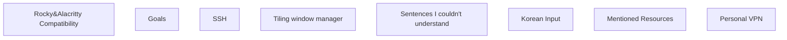

```mermaid
graph TD
    id0["Rocky&Alacritty Compatibility"]
    id1["Goals"]
    id2["SSH"]
    id3["Tiling window manager"]
    id4["Sentences I couldn't understand"]
    id5["Korean Input"]
    id6["Mentioned Resources"]
    id7["Personal VPN"]
```